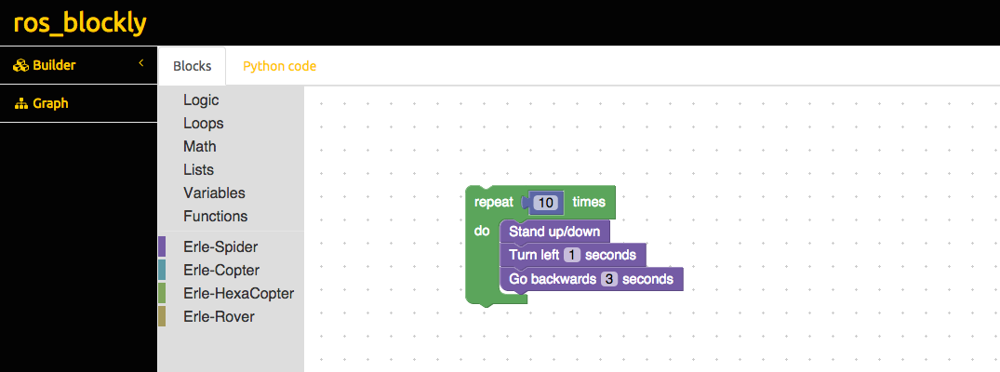

# ros_blockly

`ros_blockly` is a web-based graphical tool for programming in ROS intended to be used for kids and newbies.



### Installation:

```
# install apache
sudo apt-get install apache2
# Install dependencies
sudo pip3 install rosdep rosinstall_generator wstool rosinstall
sudo pip3 install autobahn
```

#### Frontend
```
roscd
cd ../src
git clone --recursive https://github.com/eborghi10/ros_blockly
cd ../scripts
sudo ln -s ~/caktin_ws/src/ros_blockly/frontend/ /var/www/ros_blockly
```

#### Backend
```
roscd
cd ../src
catkin_make --only-pkg-with-deps blockly
source devel/setup.bash
# Execute the ROS node
roslaunch blockly ros_blockly.launch
# now, open:
catkin_ws/src/ros_blockly/frontend/index.html
# and start playing!
```

### Create your own blocks
- Open `frontend/blockly/demos/blockfactory/index.html`
- Design you own block and then add the metadata to: `frontend/blockly/blocks` and `frontend/blockly/generator`
- Launch `python build.py` to regenerate the blocks.

### License
blockly has been built based on [blockly](http://github.com/erlerobot/blockly), [ACE](http://github.com/erlerobot/ace-builds) and Bootstrap. Refer to their sources for the corresponding licenses.

Unless specified, the rest of the code is freed under a GPLv3 License.

### Documentation
- [Erle Robotics blockly docs](http://erlerobotics.com/docs/ROS/blockly/Intro.html)
- [ROS Wiki](http://wiki.ros.org/blockly)

Do you need help getting your robot supported? Launch your questions at http://forum.erlerobotics.com.
